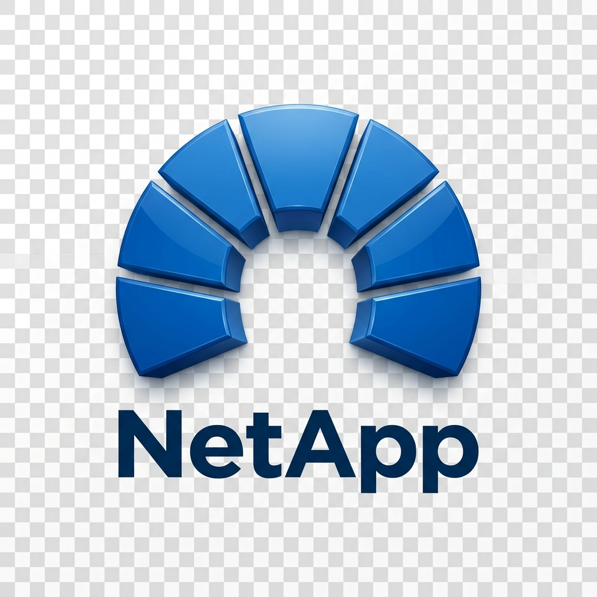

# Modern Home Assistant Integration for NetApp ONTAP (9.8P21+)



A modern, highly visual Home Assistant Custom Component integration to monitor and manage NetApp ONTAP storage systems.

## Key Features

1. **Guided Config Flow**: Fully UI-driven wizard setting up IP/Host, username/password/API tokens, and SSL verification.
2. **Dynamic Entities**: Automatic discovery and state updates of nodes, aggregates, volumes, network interfaces, and system alerts.
3. **Advanced Interactive Dashboard**: Includes a custom Lovelace card (`netapp-ontap-card.js`) rendering visual schematics with live data overlays and control interfaces.
4. **Active Controls**: Exposes safety-validated switch and button entities to trigger snapshots and enable/disable volumes with confirmation hooks.

## Installation

### Step 1: Copy Custom Component files
Copy the contents of `custom_components/netapp_ontap/` into your Home Assistant directory `config/custom_components/netapp_ontap/`.

### Step 2: Register Custom Lovelace Card
1. Copy the `dist/netapp-ontap-card.js` file into your Home Assistant `config/www/` directory.
2. Register the resource in Home Assistant Lovelace settings:
   - Go to Settings -> Dashboards -> Resources.
   - Add `/local/netapp-ontap-card.js` with type `JavaScript Module`.

### Step 3: Integration Configuration
1. Go to Settings -> Devices & Services -> Add Integration.
2. Search for **NetApp ONTAP** and follow the step-by-step connection wizard.

## Lovelace Card Configuration
Add the custom card to your dashboard:
```yaml
type: custom:netapp-ontap-card
entity: sensor.netapp_ontap_topology
title: NetApp Production Cluster
```

## Supported NetApp Versions
- NetApp ONTAP 9.8P21 and newer (using ONTAP REST API).
